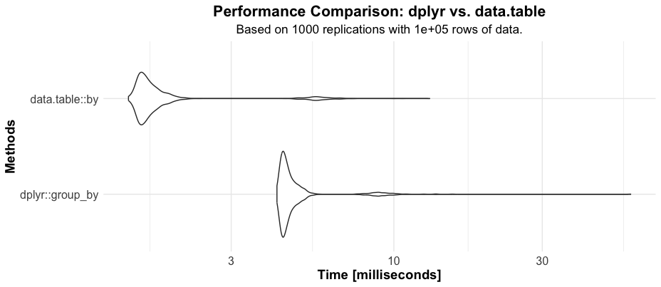
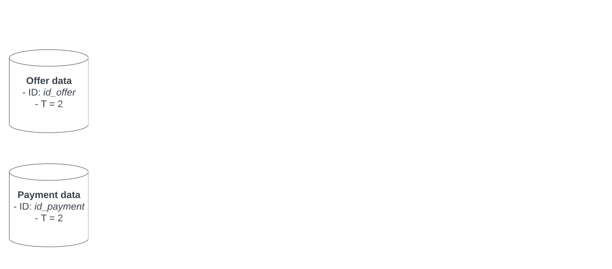
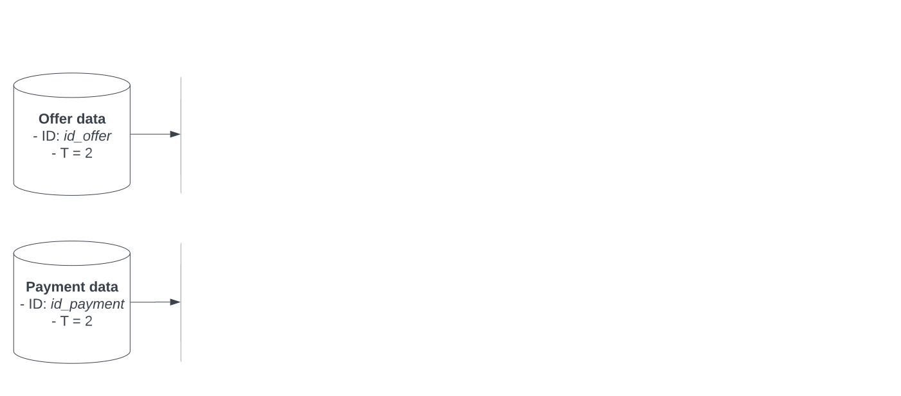
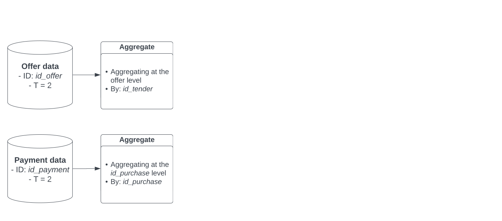
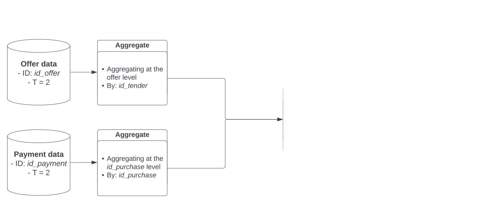
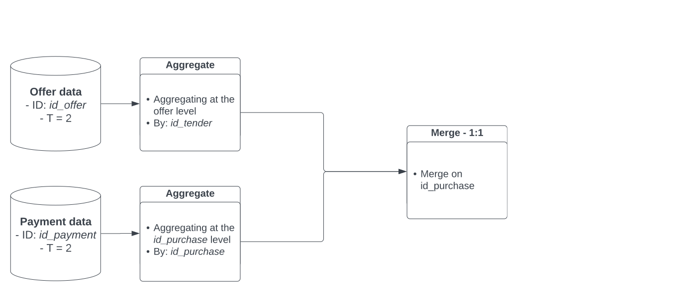
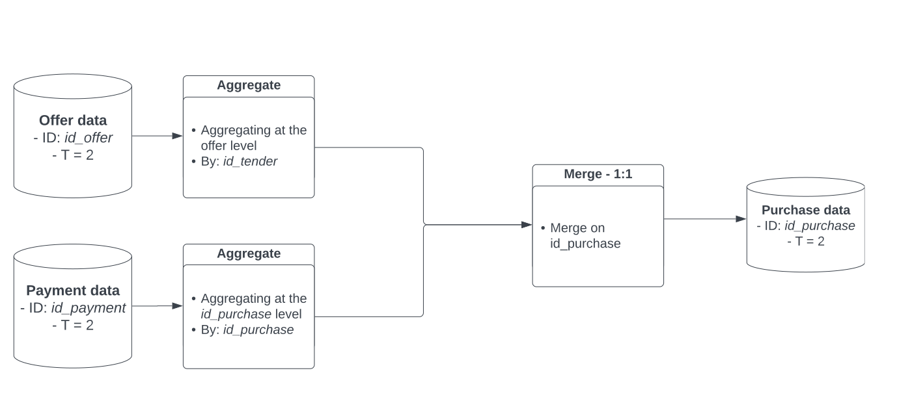

background-image: "../img/logo/WBG_Vertical-RGB-high.png"
background-position: bottom left
background-size: 110px 120px
layout: true

---

```{r setup, include=FALSE,warning=FALSE,message=FALSE}
library(data.table)
library(dplyr)
library(microbenchmark)
library(ggplot2)


options(htmltools.dir.version = FALSE)
knitr::opts_chunk$set(
  message = FALSE,
  warning = FALSE,
  dev = "svg",
  cache = TRUE,
  fig.align = "center"
  #fig.width = 11,
  #fig.height = 5
)

library(countdown)

# countdown style
countdown(
  color_border              = "#d90502",
  color_text                = "black",
  color_running_background  = "#d90502",
  color_running_text        = "white",
  color_finished_background = "white",
  color_finished_text       = "#d90502",
  color_finished_border     = "#d90502"
)

#library(learnr) # this line needs to be run manually I have no idea why but otherwise I get this error message which I can't seem to solve...
# Quitting from lines 27-40 (chapter2.Rmd) 
# Error: package or namespace load failed for 'learnr':
#  .onAttach failed in attachNamespace() for 'learnr', details:
#   call: NULL
#   error: The shiny_prerendered_chunk function can only be called from within runtime: shiny_prerendered
```

  
# Working With Data

* Econometrics is about `data`.

```{r, echo = F, out.width = "400px"}
knitr::include_graphics("chapter_tidy_files/figure-html/data_science_pipeline.png")
```

--

* According a to [2014 NYTimes article](https://www.nytimes.com/2014/08/18/technology/for-big-data-scientists-hurdle-to-insights-is-janitor-work.html), "data scientists [...] spend from ***50 percent to 80 percent of their time*** mired in this more mundane labor of collecting and preparing unruly digital data, before it can be explored for useful nuggets."

* In the next hour you will learn how to approach ***large***, ***nested*** and ***administrative*** data

---

layout: false
class: title-slide-section-red, middle

# What we have in our toolbox `r emo::ji("toolbox")`

---

<div class="my-footer"></div> 

# Pacakges we all use daily 

.pull-left-narrow[.center[]]
.pull-right-wide[
Tyding, Manipulating and Merging
]

--

.pull-left-narrow[.center[]]

.pull-right-wide[
- The wonder tool ` %>% `... but you will see me using ` |> ` `r emo::ji("exploding head")`
]

--

.pull-left-narrow[.center[]]

.pull-right-wide[
Makes [dating](https://lubridate.tidyverse.org/) fun
]

--

.pull-left-narrow[.center[]]

.pull-right-wide[
Makes [texting](https://stringr.tidyverse.org/) fun
]

--

.pull-left-narrow[.center[]]

.pull-right-wide[
Makes [visualizing](https://ggplot2-book.org/) fun
]

--

.pull-left-narrow[.center[]]

.pull-right-wide[
Makes [regressing](https://cran.r-project.org/web/packages/fixest/vignettes/fixest_walkthrough.html/) fun ([STATA users](https://stata2r.github.io/fixest/#installation/)) - [faster](https://github.com/skhiggins/R_guide) than any other R, STATA and Python packages! 
]

---

class: title-slide, top, left, inverse
background-image: url("../img/logo/einsteinoppenheimer.jpg")
background-size: cover

---
layout: true
<div class="my-footer"></div> 

# Why Aren't You Using data.table Yet?

.left-thin[

### Coincise

]

---

.right-wide[

These two code chunks do the same thing:

**Dplyr**

```{r, echo = T,results = "hide"}
# library(dplyr)
# data(starwars, package = "dplyr")

starwars %>% 
  filter(species=="Human") %>% 
  group_by(homeworld) %>% 
  summarise(mean_height=mean(height))
```

vs

**Data.Table**

```{r, echo = T,results = "hide"}
# library(data.table)

starwars_dt = as.data.table(starwars)
starwars_dt[species=="Human", mean(height), by=homeworld]

```

]

---

layout: true
<div class="my-footer"></div> 

# Why Aren't You Using data.table Yet?

.left-thin[

### Coincise
### Insanely fast

]

---

.right-wide[

```{r, echo = T, results = "hide"}
# library(dplyr)
# library(data.table)
# library(microbenchmark)
# library(ggplot2)

# 1. Generate a sample data frame
set.seed(123)
n_rows <- 1e5
sample_data <- data.frame(
  id = sample(1:1000, n_rows, replace = TRUE),
  value = rnorm(n_rows)
)
sample_dt <- as.data.table(sample_data)

# 2. Use microbenchmark to measure the time taken
n_replications <- 1000
benchmark_results <- microbenchmark(
  dplyr_group_by = sample_data %>% group_by(id) %>% summarise(mean_value = mean(value)),
  data_table_by = sample_dt[, .(mean_value = mean(value)), by = id],
  times = n_replications
)

```

]

---

.right-wide[

Take a look at this!

.center[]

Imagine getting back nearly <b>a third of your time</b>. That's what you would experience on average `r emo::ji("smiling face with sunglasses")`

]

---

layout: true

<div class="my-footer"></div> 

# Why Aren't You Using data.table Yet?

.left-thin[

### Coincise
### Insanely fast
### Memory efficient 

]

---

.right-wide[
Diving into [memory usage](https://stackoverflow.com/questions/61376970/data-table-vs-dplyr-memory-use-revisited/61376971#61376971) can get a bit tricky. But, if you want the scoop on how data.table handles it, take a look [here](chrome-extension://efaidnbmnnnibpcajpcglclefindmkaj/https://jangorecki.gitlab.io/r-talks/2019-06-18_Poznan_why-data.table/why-data.table.pdf)!
]

---

layout: true

<div class="my-footer"></div> 


# Why Aren't You Using data.table Yet?

.left-thin[

### Coincise
### Insanely fast
### Memory efficient 
### Feature rich and Dependency

]

---

I'll group these points because they're all about how your code holds up over time. But let me highlight this about [dependencies](https://www.tinyverse.org/):


```{r datatable, echo = T}
options(repos = c(CRAN = "https://cloud.r-project.org/"))
tools::package_dependencies("data.table", recursive = TRUE)[[1]]
```


```{r dplyr, echo = T}
options(repos = c(CRAN = "https://cloud.r-project.org/"))
tools::package_dependencies("dplyr", recursive = TRUE)[[1]]
```

---

layout: true
class: middle, center

---

# Did I convince you about data.table?

--

----

.pull-left[
This is not a full course on Data.Table (unfortunately) ...
]

--

.pull-right[
<iframe src="https://giphy.com/embed/pPhyAv5t9V8djyRFJH" width="380" height="200" frameBorder="0" class="giphy-embed" allowFullScreen></iframe><p><a href="https://giphy.com/gifs/wtf-obama-wth-pPhyAv5t9V8djyRFJH"></a></p>
]

--

.pull-right-narrow[
... but I will solve exercises using both dplyr and data.table side by side!
]

--

.center[
<iframe src="https://giphy.com/embed/MNmyTin5qt5LSXirxd" width="400" height="200" frameBorder="0" class="giphy-embed" allowFullScreen></iframe><p><a href="https://giphy.com/gifs/theoffice-MNmyTin5qt5LSXirxd"></a></p>
]

---
layout: true
class: middle, center

---

# In the meantime

----

.pull-left[
<iframe src="https://giphy.com/embed/emLs5klEWTKlSVeexj" width="480" height="270" frameBorder="0" class="giphy-embed" allowFullScreen></iframe><p><a href="https://giphy.com/gifs/voice-actor-jeff-bergman-jeffbergman-emLs5klEWTKlSVeexj"></a></p>
]
.pull-right[
- .left[[Introductory course](https://raw.githack.com/floswald/lectures/master/05-datatable/05-datatable.html) by Professor [Florian Oswald](https://floswald.github.io/) (SciencesPo) and Professor [Grant Mc Dermott](https://grantmcdermott.com/)]
- .left[The [full handbook](https://cran.r-project.org/web/packages/data.table/vignettes/datatable-intro.html): 99% of you all neeed to know about the package]
- .left[[Package Documentation](https://cran.r-project.org/web/packages/data.table/index.html)]
- .left[[CheatSheet](https://github.com/Rdatatable/data.table#cheatsheets)]
- .left[Really nice, side-by-side [comparisons](https://atrebas.github.io/post/2019-03-03-datatable-dplyr/) of common data.table and dplyr operations]
]

---
layout: true
class: middle, center

---

# In the meantime

----

.pull-left[
<iframe src="https://giphy.com/embed/emLs5klEWTKlSVeexj" width="480" height="270" frameBorder="0" class="giphy-embed" allowFullScreen></iframe><p><a href="https://giphy.com/gifs/voice-actor-jeff-bergman-jeffbergman-emLs5klEWTKlSVeexj"></a></p>
]
.pull-right[
- .left[<span style="background-color: yellow;"> [Introductory course](https://raw.githack.com/floswald/lectures/master/05-datatable/05-datatable.html) by Professor [Florian Oswald](https://floswald.github.io/) (SciencesPo) and Professor [Grant Mc Dermott](https://grantmcdermott.com/)</span>]
- .left[The [full handbook](https://cran.r-project.org/web/packages/data.table/vignettes/datatable-intro.html): 99% of you all neeed to know about the package]
- .left[[Package Documentation](https://cran.r-project.org/web/packages/data.table/index.html)]
- .left[[CheatSheet](https://github.com/Rdatatable/data.table#cheatsheets)]
- .left[<span style="background-color: yellow;"> Really nice, side-by-side [comparisons](https://atrebas.github.io/post/2019-03-03-datatable-dplyr/) of common data.table and dplyr operations]</span>]

---

class: inverse

# Task 1: Load the Packages

.left[We start loading all the necessary packages and set up]

```{r, eval = FALSE}
# 0: Setting R ----
    
    # Clean the workspace
    rm(list=ls()) 
    # Free Unused R memory
    gc()
    # Options for avoid scientific notation
    options(scipen = 9999)
    # Set the same seed
    set.seed(123)
    # list of package needed
    packages <- 
      c( 
        "data.table",
        "dplyr",
        "stringr",
        "lubridate",
        "ggplot2"
      )
    # If the package is not installed, then install it 
    if (!require("pacman")) install.packages("pacman")
    # Load the packages 
    pacman::p_load(packages, character.only = TRUE, install = TRUE)

# 1: Setting Working Directories ----
        
  # Setting path
  if (Sys.getenv("USER") == "ruggerodoino") { # RA (World Bank-DIME)
    print("Ruggero has been selected")
    dropbox_dir  <- "/Users/ruggerodoino/Dropbox/ChilePaymentProcurement/Reproducible-Package" 
    github_dir   <- "/Users/ruggerodoino/Documents/GitHub/chile-payment-procurement/Reproducible-Package" 
  }
```

---

class: inverse

# Task 1: Load the Packages

.left[We start loading all the necessary packages and set up]

```{r, eval = FALSE}
# 0: Setting R ----
    
    # Clean the workspace
    rm(list=ls()) 
    # Free Unused R memory
    gc()
    # Options for avoid scientific notation
    options(scipen = 9999)
    # Set the same seed
    set.seed(123)
    # list of package needed
    packages <- 
      c( 
        "data.table",
        "dplyr",
        "stringr",
        "lubridate",
        "ggplot2"
      )
    # If the package is not installed, then install it 
    if (!require("pacman")) install.packages("pacman")
    # Load the packages 
    pacman::p_load(packages, character.only = TRUE, install = TRUE)

# 1: Setting Working Directories ----
        
  # Setting path
  if (Sys.getenv("USER") == "ruggerodoino") { # RA (World Bank-DIME)
    print("Ruggero has been selected")
    dropbox_dir  <- "/Users/ruggerodoino/Dropbox/ChilePaymentProcurement/Reproducible-Package"  #<<
    github_dir   <- "/Users/ruggerodoino/Documents/GitHub/chile-payment-procurement/Reproducible-Package"  #<<
  }
```

---

class: inverse

# Task 1: Load the Packages

```{r, echo = FALSE}
countdown(minutes = 2, top = 0)
```

.left[We start loading all the necessary packages and set up]

```{r, eval = FALSE}
# 0: Setting R ----
    
    # Clean the workspace
    rm(list=ls()) 
    # Free Unused R memory
    gc()
    # Options for avoid scientific notation
    options(scipen = 9999)
    # Set the same seed
    set.seed(123)
    # list of package needed
    packages <- 
      c( 
        "data.table",
        "dplyr",
        "stringr",
        "lubridate",
        "ggplot2"
      )
    # If the package is not installed, then install it 
    if (!require("pacman")) install.packages("pacman")
    # Load the packages 
    pacman::p_load(packages, character.only = TRUE, install = TRUE)

# 1: Setting Working Directories ----
        
  # Setting path
  if (Sys.getenv("USER") == "ruggerodoino") { # RA (World Bank-DIME)
    print("Ruggero has been selected")
    dropbox_dir  <- "/Users/ruggerodoino/Dropbox/ChilePaymentProcurement/Reproducible-Package" #<<
    github_dir   <- "/Users/ruggerodoino/Documents/GitHub/chile-payment-procurement/Reproducible-Package" #<<
  }
```

---

layout: false
class: title-slide-section-red, middle

# Let's go `r emo::ji("woman climbing")`

---
class: middle, center

# .center[Main Challenges of Administrative Data]

--

----

.center[
`r emo::ji("potable_water")` Data Source
]

--
.center[
`r emo::ji("world_map")` Data Structure
]

--

.center[
`r emo::ji("musical_notes")` Data Harmonization
]

--

.center[
`r emo::ji("chains")` Data Integration
]

--

.center[
`r emo::ji("warning")` Data inconsistencies and quality
]

--

.center[
`r emo::ji("twisted_rightwards_arrows")` Temporal Inconsistencies/Sample Unbalances
]

---

layout: false
class: title-slide-section-red, middle

# Data Source `r emo::ji("potable_water")`

---

<div class="my-footer"></div> 

# Data Source 

.pull-right-narrow[
#### 1) Origin of Administrative Data
]

.pull-left-wide[
  `r emo::ji("mag")` Administrative data primarily originate from the routine administrative processes of organizations and institutions. 
    
  `r emo::ji("note")` Tax records, health records, school enrollment data, social service records, and employment records.
]

--

#### 2) Where to find them 

.pull-left-wide[
  `r emo::ji("classical_building")` The accessibility of administrative data largely depends on the policies of the data sources.
    
  `r emo::ji("globe_with_meridians")` Admin data is frequently sourced through web scraping to maintain reproducibility. --> two resources that can help: [beginner](https://statsandr.com/blog/web-scraping-in-r/) and [advanced](https://r4ds.hadley.nz/webscraping.html). 
]

---

class: inverse

# Task 2: Load the Datasets

```{r, echo = FALSE}
countdown(minutes = 5, top = 0)
```

We first load the offer-level dataset:

.pull-left[

```{r, eval = FALSE}
# DATA.TABLE

# Load offer-level data
data_offer <- fread(
  input = file.path(raw_data, "offer_level.csv"),
  encoding = "Latin-1",
  stringsAsFactors = TRUE, 
  colClasses = c(" |> ", "character", "factor"), 
  na.strings = c("N/A", "Unknown"),
  showProgress = TRUE
)


#
```
]

.pull-right[
```{r, eval = FALSE}
# DPLYR

# Load offer-level data
data_offer <- file.path(raw_data, "offer_level.csv") %>%
  read_csv(
    col_types = cols(
      .default = col_character(),
      column_name_1 = col_double(),
      column_name_2 = col_character(),
      column_name_3 = col_factor()
    ),
    na = c("N/A", "Unknown"),
    progress = TRUE,
    locale = locale(encoding = "Latin-1")
  )

```
]

And, then we load the payment-level datasets:

.pull-left[

```{r, eval = FALSE}
# DATA.TABLE

# Load payment-level data
data_offer <- fread(
  input = file.path(raw_data, "payment_level.csv"),
  encoding = "Latin-1",
  stringsAsFactors = TRUE, 
  colClasses = c("numeric", "character", "factor"), 
  na.strings = c("N/A", "Unknown"),
  showProgress = TRUE
)


#
```
]

.pull-right[
```{r, eval = FALSE}
# TYDIVERSE/DPLYR

# Load payment-level data
data_payment <- file.path(raw_data, "payment_level.csv") %>%
  read_csv(
    col_types = cols(
      .default = col_character(),
      column_name_1 = col_double(),
      column_name_2 = col_character(),
      column_name_3 = col_factor()
    ),
    na = c("N/A", "Unknown"),
    progress = TRUE,
    locale = locale(encoding = "Latin-1")
  )

```
]


---

layout: false
class: title-slide-section-red, middle

# Data Structure `r emo::ji("world_map")`

---
class: middle, center
# Data Structure

--

.pull-left[
Once I received a folder with 14 datasets and no information whatsoever...
]

--

.pull-right[
<iframe src="https://giphy.com/embed/pynZagVcYxVUk" width="280" height="180" frameBorder="0" class="giphy-embed" allowFullScreen></iframe><p><a href="https://giphy.com/gifs/the-office-michael-heartbreak-pynZagVcYxVUk"></a></p>
]

--

.center[
... so what do we do? 
]

--

.center[
`r emo::ji("arrows_counterclockwise")` Understand the administrative process
]

--

.center[
`r emo::ji("link")` Understand the data architecture built upon the administrative process
]

---

layout: false

class: title-slide, top, left, inverse
background-image: url("../img/logo/1_slide.jpg")
background-size: cover

---

class: title-slide, top, left, inverse
background-image: url("../img/logo/2_slide.jpg")
background-size: cover

---

class: title-slide, top, left, inverse
background-image: url("../img/logo/3_slide.jpg")
background-size: cover

---

class: title-slide, top, left, inverse
background-image: url("../img/logo/4_slide.jpg")
background-size: cover

---

class: title-slide, top, left, inverse
background-image: url("../img/logo/5_slide.jpg")
background-size: cover
---

class: title-slide, top, left, inverse
background-image: url("../img/logo/6_slide.jpg")
background-size: cover

---

class: title-slide, top, left, inverse
background-image: url("../img/logo/7_slide.jpg")
background-size: cover

---

class: title-slide, top, left, inverse
background-image: url("../img/logo/8_slide.jpg")
background-size: cover

---

class: title-slide, top, left, inverse
background-image: url("../img/logo/9_slide.jpg")
background-size: cover

---

<div class="my-footer"></div> 

# Data Structure

.left-thin[

### Unit of Observation

]

--

.right-wide[
`r emo::ji("pushpin")` "The unit of observation, sometimes referred to as the unit of measurement, is defined statistically as the “who” or “what” for which data are measured or collected."([Philip Sedgwick](chrome-extension://efaidnbmnnnibpcajpcglclefindmkaj/https://www.bmj.com/content/bmj/348/bmj.g3840.full.pdf)) 
]

--

.right-wide[
`r emo::ji("light_bulb")` A unit of observation need to be <b>fully and uniquely identified by an ID</b> - create an appropriate ID variable accordingly if it does not yet exist.
]

--

.right-wide[
1. <i>What's our unit of observation?</i>
2. <i>What's our ID?</i>
]

---

<div class="my-footer"></div> 

# Data Structure

.left-thin[

### Unit of Observation
### Unit of Analysis

]

--

.right-wide[
`r emo::ji("pushpin")` "The unit of analysis is defined statistically as the “who” or “what” for which information is analysed and conclusions are made." ([Philip Sedgwick](chrome-extension://efaidnbmnnnibpcajpcglclefindmkaj/https://www.bmj.com/content/bmj/348/bmj.g3840.full.pdf))
]

--

.right-wide[
`r emo::ji("light_bulb")` Administrative data often encompass multiple levels of analysis, each corresponding to the various participants in the administrative procedure. 
]

--

.right-wide[
1. <i>What are all the potential units of analysis?</i>
2. <i>What are their own IDs?</i>
]

---

<div class="my-footer"></div> 

# Data Structure

.left-thin[

### Unit of Observation
### Unit of Analysis
### Mapping the Data

]

--

.right-wide[
`r emo::ji("pushpin")` "Data flow charts allow the research team to visualize which datasets are needed in order to create the datasets that will finally be used for the analysis." ([DIME Analytics](https://dimewiki.worldbank.org/Data_Flow_Charts))
]

--

.right-wide[
`r emo::ji("hammer")` Check this free [web-tool](https://www.lucidchart.com/pages/data-flow-diagram)!
]

--

.center[]

---

<div class="my-footer"></div> 

# Data Structure

.left-thin[

### Unit of Observation
### Unit of Analysis
### Mapping the Data

]

.right-wide[
`r emo::ji("pushpin")` "Data flow charts allow the research team to visualize which datasets are needed in order to create the datasets that will finally be used for the analysis." ([DIME Analytics](https://dimewiki.worldbank.org/Data_Flow_Charts))
]
.right-wide[
`r emo::ji("hammer")` Check this free [web-tool](https://www.lucidchart.com/pages/data-flow-diagram)!
]
.center[]

---

<div class="my-footer"></div> 

# Data Structure

.left-thin[

### Unit of Observation
### Unit of Analysis
### Mapping the Data

]

.right-wide[
`r emo::ji("pushpin")` "Data flow charts allow the research team to visualize which datasets are needed in order to create the datasets that will finally be used for the analysis." ([DIME Analytics](https://dimewiki.worldbank.org/Data_Flow_Charts))
]
.right-wide[
`r emo::ji("hammer")` Check this free [web-tool](https://www.lucidchart.com/pages/data-flow-diagram)!
]
.center[]

---

<div class="my-footer"></div> 

# Data Structure

.left-thin[

### Unit of Observation
### Unit of Analysis
### Mapping the Data

]

.right-wide[
`r emo::ji("pushpin")` "Data flow charts allow the research team to visualize which datasets are needed in order to create the datasets that will finally be used for the analysis." ([DIME Analytics](https://dimewiki.worldbank.org/Data_Flow_Charts))
]
.right-wide[
`r emo::ji("hammer")` Check this free [web-tool](https://www.lucidchart.com/pages/data-flow-diagram)!
]
.center[]

---

<div class="my-footer"></div> 

# Data Structure

.left-thin[

### Unit of Observation
### Unit of Analysis
### Mapping the Data

]

.right-wide[
`r emo::ji("pushpin")` "Data flow charts allow the research team to visualize which datasets are needed in order to create the datasets that will finally be used for the analysis." ([DIME Analytics](https://dimewiki.worldbank.org/Data_Flow_Charts))
]
.right-wide[
`r emo::ji("hammer")` Check this free [web-tool](https://www.lucidchart.com/pages/data-flow-diagram)!
]
.center[]

---

<div class="my-footer"></div> 

# Data Structure

.left-thin[

### Unit of Observation
### Unit of Analysis
### Mapping the Data

]

.right-wide[
`r emo::ji("pushpin")` "Data flow charts allow the research team to visualize which datasets are needed in order to create the datasets that will finally be used for the analysis." ([DIME Analytics](https://dimewiki.worldbank.org/Data_Flow_Charts))
]
.right-wide[
`r emo::ji("hammer")` Check this free [web-tool](https://www.lucidchart.com/pages/data-flow-diagram)!
]
.center[]

---

layout: false
class: title-slide-section-red, middle

# Data Harmonization `r emo::ji("musical_notes")`

---

class: title-slide, top, left, inverse
background-image: url("../img/logo/data_harmonization.jpeg")
background-size: cover

---

<div class="my-footer"></div> 

# Data Harmonization

.left-thin[

### Naming Convention

]

--

.right-wide[
`r emo::ji("label")` There are several <b>naming conventions</b> [out there](https://bookdown.org/content/d1e53ac9-28ce-472f-bc2c-f499f18264a3/names.html). Here, we will follow the so-called "snake_case".
  - These names are all lower case with underscore between the name. My name in <i>snake_case</i> would be <i>ruggero_doino<i/>.
]

--

.right-wide[
`r emo::ji("book")` <b>Controlled Vocabulary</b> "The basic idea of controlled vocabularies is to define upfront a set of words, phrases, or stubs with well-defined meanings which can be used to index information." ([Emily Redierer](https://emilyriederer.netlify.app/post/column-name-contracts/))
]

--

.right-wide[
.center[

]
]

---

<div class="my-footer"></div> 

# Data Harmonization

.left-thin[

### Naming Convention

]

.right-wide[
<b>Level 1: Measure Types</b>:

  - <b>id</b>: Unique identified for an entity.
  - <b>ind</b>: Binary 0 or 1 indicator or an event occurrence
  - <b>n</b>: Count of quantity or event occurrence
  - <b>amt</b>: Sum-able real number amount. That is, any non-count amount that is “denominator-free”
  - <b>val</b>: Numeric variables that are not inherently sum-able
  - <b>dt</b>: Date of some event
  - <b>tm</b>: Time stamp of some event
  - <b>cat</b>: Categorical variable as a character string (potentially encoded from an ID field)
  - <b>str</b>: String variable usually used for describing a characteristic 
]

---

<div class="my-footer"></div> 

# Data Harmonization

.left-thin[

### Naming Convention

]

.right-wide[
<b>Level 2: Measure Subjects</b>

  - <b>buyer</b>: public procuring entity
  - <b>firm</b>: firm entity
  - <b>tender</b>: auction 
  - <b>payment</b>: payment transaction
  - <b>purchase</b>: signed contract
  - <b>offer</b>: offer submitted to the auction
]

---

<div class="my-footer"></div> 

# Data Harmonization

.left-thin[

### Naming Convention

]

.right-wide[
<b>Level 3-n: Details</b>

  - <b>region</b>: region of origin
  - <b>city</b>: city of origin
  - <b>total</b>: total value
  - <b>diff_ack_pay</b>: difference between payment acknowledgment and actual payment
  - <b>send</b>: date of start sending offers 
  - <b>unspsc</b>: UNSPSC item classification code 
]

---

<div class="my-footer"></div> 

# Data Harmonization

.left-thin[

### Naming Convention

]

.right-wide[
<b>Putting it all together</b>

  - <b>id_firm_tax</b>: unique tax identifier for each firm
  - <b>str_firm_city</b>: character string to define the origin city for each firm
  - <b>str_buyer_region</b>: character string to define the origin region for each firm
  - <b>ind_offer_win</b>: 1 if offer was selected 
  - <b>amt_offer_total</b>: total amount offered 
  - <b>id_item_unspsc</b>: unique UNSPSC identifier for each item 
]

---

<div class="my-footer"></div> 

# Data Harmonization

.left-thin[

### Naming Convention
### Variable Harmonization

]

.right-wide[
`r emo::ji("clipboard")` Checklist:
  - <b>Dates</b>: all dates ("dt_") need to be formatted as such, [lubridate](https://lubridate.tidyverse.org/) package is key: `lubridate::dmy()`
  - <b>Numeric</b>: all numeric values ("n_"|"amt_") need to be formatted as such, `as.numeric()` (`r emo::ji("warning")` sometimes decimal separators are coded with commas)
  - <b>Strings</b>: 
    - `stringr::str_squish()` removes whitespace before and after strings, and reduced repeated interior whitespace to a single space 
    - `stringr::str_to_lower()` converts to lowercase
    - `stringr::str_remove_all("[^[:alnum:]]")` can be used to remove all non-alphanumeric characters
  - <b>Factors</b>: all factor variables ("ind_") need to be formatted as such, `as.factor()`
  - <b>Coded Identifiers</b>: all IDs ("id_"), when standardized, should be verified. Example: tax identifiers
]

---

layout: false
class: title-slide-section-red, middle

# Data Integration `r emo::ji("chains")`

---

class: title-slide, top, left, inverse
background-image: url("../img/logo/first_data_harmonization.jpeg")
background-size: cover

---

class: title-slide, top, left, inverse
background-image: url("../img/logo/second_data_integration.jpeg")
background-size: cover

---

<div class="my-footer"></div> 

# Data Integration

.left-thin[

### Merging

]

.right-wide[

`r emo::ji("chains")` Integrating or merging data from different sources or tables is a common task in data management and analytics. 

]

---

<div class="my-footer"></div> 

# Data Integration

.left-thin[

### Merging

]

.right-wide[

`r emo::ji("chains")` Integrating or merging data from different sources or tables is a common task in data management and analytics. 

`r emo::ji("clipboard")` Checklist:
]

---

<div class="my-footer"></div> 

# Data Integration

.left-thin[

### Merging

]

.right-wide[

`r emo::ji("chains")` Integrating or merging data from different sources or tables is a common task in data management and analytics. 

`r emo::ji("clipboard")` Checklist:
  1. `r emo::ji("white_check_mark")` <b>Understand Your Data</b>: familiarize yourself with the structure, format, and quality of your data sources.

]

---

<div class="my-footer"></div> 

# Data Integration

.left-thin[

### Merging

]

.right-wide[

`r emo::ji("chains")` Integrating or merging data from different sources or tables is a common task in data management and analytics. 

`r emo::ji("clipboard")` Checklist:
  1. `r emo::ji("white_check_mark")` <b>Understand Your Data</b>: familiarize yourself with the structure, format, and quality of your data sources.
  2. `r emo::ji("cross_mark")` <b>Lack of Familiarity</b>: <u>avoid</u> integrating data when its quality and structure are in doubt.

]

---

<div class="my-footer"></div> 

# Data Integration

.left-thin[

### Merging

]

.right-wide[

`r emo::ji("chains")` Integrating or merging data from different sources or tables is a common task in data management and analytics. 

`r emo::ji("clipboard")` Checklist:
  1. `r emo::ji("white_check_mark")` <b>Understand Your Data</b>: familiarize yourself with the structure, format, and quality of your data sources.
  2. `r emo::ji("cross_mark")` <b>Lack of Familiarity</b>: <u>avoid</u> integrating data when its quality and structure are in doubt.
  3. `r emo::ji("white_check_mark")` <b>Define Clear Objectives</b>: clearly define the purpose of merging or integrating (`r emo::ji("light_bulb")` you can always map the data).

]

---

<div class="my-footer"></div> 

# Data Integration

.left-thin[

### Merging

]

.right-wide[

`r emo::ji("chains")` Integrating or merging data from different sources or tables is a common task in data management and analytics. 

`r emo::ji("clipboard")` Checklist:
  1. `r emo::ji("white_check_mark")` <b>Understand Your Data</b>: familiarize yourself with the structure, format, and quality of your data sources.
  2. `r emo::ji("cross_mark")` <b>Lack of Familiarity</b>: <u>avoid</u> integrating data when its quality and structure are in doubt.
  3. `r emo::ji("white_check_mark")` <b>Define Clear Objectives</b>: clearly define the purpose of merging or integrating (`r emo::ji("light_bulb")` you can always map the data).
  4. `r emo::ji("white_check_mark")` <b>Ensure Consistent Data Types</b>: before merging, make sure that columns you're joining on have consistent data types in both tables.
]

---

<div class="my-footer"></div> 

# Data Integration

.left-thin[

### Merging

]

.right-wide[

`r emo::ji("chains")` Integrating or merging data from different sources or tables is a common task in data management and analytics. 

`r emo::ji("clipboard")` Checklist:
  1. `r emo::ji("white_check_mark")` <b>Understand Your Data</b>: familiarize yourself with the structure, format, and quality of your data sources.
  2. `r emo::ji("cross_mark")` <b>Lack of Familiarity</b>: <u>avoid</u> integrating data when its quality and structure are in doubt.
  3. `r emo::ji("white_check_mark")` <b>Define Clear Objectives</b>: clearly define the purpose of merging or integrating (`r emo::ji("light_bulb")` you can always map the data).
  4. `r emo::ji("white_check_mark")` <b>Ensure Consistent Data Types</b>: before merging, make sure that columns you're joining on have consistent data types in both tables.
  5. `r emo::ji("white_check_mark")` <b>Document the Process</b>: ensure that every step, decision, and assumption made during the integration process is well-documented.
]

---

<div class="my-footer"></div> 

# Data Integration

.left-thin[

### Merging

]

.right-wide[
#### The Ultimate Triad of Merging
]
--
.right-wide[
<ol start="1">
  <li>`r emo::ji("key")` <b>Key Matching</b>: ensure that you have <u><b>unique</b></u> and <u><b>non-missing</b></u> keys to match on. </li>
</ol>
]


--
.right-wide[
<ol start="2">
  <li>`r emo::ji("balance_scale")` <b>Same Granularity Level</b> avoid merging data directly if they are not at the  <u><b>same level of granularity</b></u>. Aggregate or disaggregate data to the appropriate level before merging. </li>
</ol>
]

--
.right-wide[
<ol start="3">
  <li>`r emo::ji("left_arrow")` <b>99% Left Joins</b>: using a left join can ensure you retain all records from your primary (left) table. This ensures you <u><b>don't lose any data</b></u>, but it can introduce null values for unmatched records. </li>
</ol>
]

---


<div class="my-footer"></div> 

# Data Integration

.left-thin[

### Merging
### Fuzzy Matching

]

.right-wide[

`r emo::ji("thinking_face")` What happens if we don't have a clear, consistent and unique ket to match on?

]
--
.right-wide[

<i>Example: say that we want to match sector names with ISIC standardized sector codes</i>

]
---
<div class="my-footer"></div> 

# Data Integration

.left-thin[

### Merging
### Fuzzy Matching

]

.right-wide[

`r emo::ji("thinking_face")` What happens if we don't have a clear, consistent and unique ket to match on?

<i>Example: say that we want to match sector names with ISIC standardized sector codes</i>

  1. `r emo::ji("musical_notes")` Data Harmonization is key here. Ensure that texts are clean following the best practices, and sometimes you just need to do some further steps (<i>Example: "Retail and Services Sector" vs "Retail and Services"</i>)
  
]
---
<div class="my-footer"></div> 

# Data Integration

.left-thin[

### Merging
### Fuzzy Matching

]

.right-wide[

`r emo::ji("thinking_face")` What happens if we don't have a clear, consistent and unique ket to match on?

<i>Example: say that we want to match sector names with ISIC standardized sector codes</i>


  1. `r emo::ji("musical_notes")` Data Harmonization is key here. Ensure that texts are clean following the best practices, and sometimes you just need to do some further steps (<i>Example: "Retail and Services Sector" vs "Retail and Services"</i>).
  2. `r emo::ji("puzzle")` `library(stringdist)` provides several methods to compute string distances and perform approximate string matching, or you can use the `library(fuzzyjoin)` that performs joins using the same methods. 
  
]

---
<div class="my-footer"></div> 

# Data Integration

.left-thin[

### Merging
### Fuzzy Matching

]

.right-wide[

`r emo::ji("thinking_face")` What happens if we don't have a clear, consistent and unique ket to match on?

<i>Example: say that we want to match sector names with ISIC standardized sector codes</i>

  1. `r emo::ji("musical_notes")` Data Harmonization is key here. Ensure that texts are clean following the best practices, and sometimes you just need to do some further steps (<i>Example: "Retail and Services Sector" vs "Retail and Services"</i>).
  2. `r emo::ji("puzzle")` `library(stringdist)` provides several methods to compute string distances and perform approximate string matching, or you can use the `library(fuzzyjoin)` that performs joins using the same methods. 
  3. `r emo::ji("robot")` [ChatGPT](https://chat.openai.com/) (3.5 or 4 is better)... say no more!
  
]

---

class: inverse

# Task 3: Excercise about Aggregating an Joining at different levels

```{r, echo = FALSE}
countdown(minutes = 15, top = 0)
```

Ideas? Need to fill this yet. 

---

layout: false
class: title-slide-section-red, middle

# Data Inconsistencies and Sample Unbalances `r emo::ji("warning")`

---

class: title-slide, top, left, inverse
background-image: url("../img/logo/outlier.jpeg")
background-size: cover

---

<div class="my-footer"></div> 

# Data Inconsistencies and Sample Unbalances

.left-thin[

### Missing Values

]

--

.right-wide[
`r emo::ji("label")` There are several <b>naming conventions</b> [out there](https://bookdown.org/content/d1e53ac9-28ce-472f-bc2c-f499f18264a3/names.html). Here, we will follow the so-called "snake_case".
  - These names are all lower case with underscore between the name. My name in <i>snake_case</i> would be <i>ruggero_doino<i/>.
]

--

.right-wide[
`r emo::ji("book")` <b>Controlled Vocabulary</b> "The basic idea of controlled vocabularies is to define upfront a set of words, phrases, or stubs with well-defined meanings which can be used to index information." ([Emily Redierer](https://emilyriederer.netlify.app/post/column-name-contracts/))
]

--

.right-wide[
.center[

]
]

---

<div class="my-footer"></div> 

# Data Inconsistencies and Sample Unbalances

.left-thin[

### Missing Values
### Outliers

]

---

<div class="my-footer"></div> 

# Data Inconsistencies and Sample Unbalances

.left-thin[

### Missing Values
### Outliers
### Sample Imbalances

]

---

class: inverse

# Task 3: Excercise about Aggregating an Joining at different levels

```{r, echo = FALSE}
countdown(minutes = 15, top = 0)
```

Ideas? Need to fill this yet. 

---

layout: false
class: center

.center[
<b>Major Credits</b> to :
]

.left[
- Thiago Scot, Antoine Debb, Maria, and Tatiana for feedbacks.
- Professor Florand from whom I used a lot of resources especially for building the presentation
- Professor 
- Blog Emily
- Blog that I used for packages 
- 
]

---

layout: true
class: middle, center

---

# THANKS!

.center[
Time to help me now! `r emo::ji("folded_hands")`
]
.center[

]
